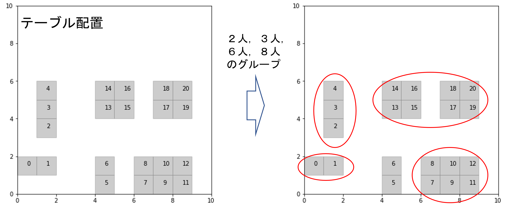

# 量子アニーリングマシンによる座席配置問題の解法

## はじめに

本プログラムはIPA（独立行政法人情報処理推進機構）が2021年11月から2022年2月にかけて主催した、量子コンピューティング技術実践講座（アニーリングマシン）による成果です。

- [【全3回】量子コンピューティング技術実践講座（アニーリングマシン）](https://mitoutg.connpass.com/event/228688/)

## 概要

### 問題設定

複数グループの人なるべく効率的にテーブルに配置させるという問題を考えます。

「効率的に」とは以下の条件を満たすことを指すこととします。

１．テーブルの座席数をなるべく埋める（４人掛けのテーブルにはなるべく４人グループを割り当てる）
２．グループが同じ人はなるべく近いテーブルに座らせる
３．他のグループとの距離はなるべく離す

### 実行環境

- Google Colab

Fixstar Amplify社が提供するSDKを使用するため，事前に無料のトークンを作成する必要があります。
- [Fixstar Amplify](https://amplify.fixstars.com/ja/)

